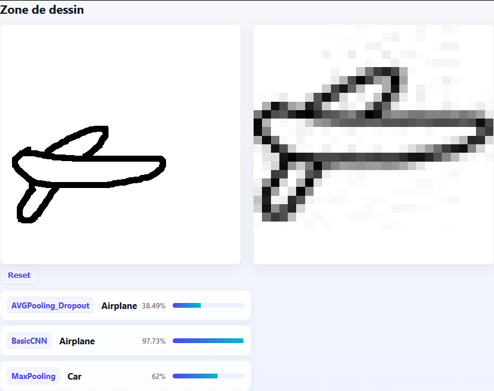

# QuickDraw images recognition models

4 different models:

- BasicMLP: a very simple MLP (multi-layer perceptron)
- BasicCNN: a sequential CNN with 3 stacked Conv2D layers
- MaxPooling: BasicCNN + MaxPooling2D between convolution layers
- AVGPooling_Dropout: MaxPooling + GlobalAveragePooling2D and Dense layers

I trained these models on a merge of 10 datasets from [Google QuickDraw](https://console.cloud.google.com/storage/browser/quickdraw_dataset/full/numpy_bitmap), namely:

- dog
- airplane
- book
- Eiffel Tower
- car
- face (smiley)
- chair
- apple
- brain
- eye

This is a 28x28x1 dataset (single-channel, grayscale), so it is not very good on "real" drawings. I resize the drawing on the server side, then I pass the resized image to the 3 benchmark models.

You draw, then the 4 predictions are made in real time, and you get the predictions with their associated accuracies.

If you want to run this project, you have to download some `.npy` files from [Google QuickDraw Dataset](https://console.cloud.google.com/storage/browser/quickdraw_dataset/full/numpy_bitmap), put those files in the `quickdraw_dataset` folder. Then, install the requirements and run : 

```bash
uv sync
uv run main.py
```


